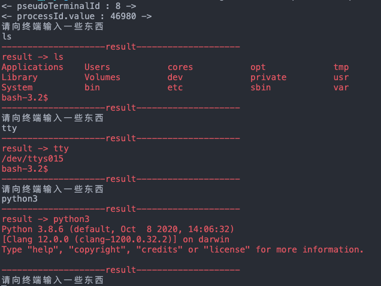

# dart_pty

Language: [English](README-EN.md) | 中文简体

## 介绍

创建一个伪终端并执行一个子进程。也是终端模拟器的底层实现。
与编程语言提供的执行进程不同，它不仅能够无缓冲的拿到 stdout、stderr 输出，还能拿到所有的终端序列，也能对进程进行交互。

**举个简单的例子**

我们在 shell 执行以下命令:
```shell
echo -e "\033[31m hello \033[0m"
```
这个时候会看见终端打印了红色的“hello”，因为终端模拟器不仅拿到了字符“hello”，还拿到了前后改变颜色的控制序列。

我们通过 java 的 runtime.exec 函数，或者 python 的 system 函数，c 语言的 system 函数，这一系列高级语言所提供的执行进程的函数，我们执行 python，会发现无论如何也拿不到命令的输出，其原因在于终端与管道的缓冲机制。

所以此项目在于实现获得进程实时的输出流，并提供与进程交互的功能。
## 使用方法
参考 [test.dart](test/test.dart)
```dart
Future<void> main() async {
  Map<String, String> environment = {'TEST': 'TEST_VALUE'};
  UnixPtyC unixPthC = UnixPtyC(
    environment: environment,
    libPath: 'dynamic_library/libterm.dylib',
  );
  await Future.delayed(Duration(milliseconds: 100));
  String result;
  unixPthC.read();
  await Future.delayed(Duration(milliseconds: 100), () async {
    while (true) {
      print('请向终端输入一些东西');
      String input = stdin.readLineSync();
      unixPthC.write(input + '\n');
      await Future.delayed(Duration(milliseconds: 200));
      result = unixPthC.read();
      print('-' * 20 + 'result' + '-' * 20);
      print('result -> $result');
      print('-' * 20 + 'result' + '-' * 20);
      await Future.delayed(Duration(milliseconds: 100));
    }
  });
}
```
运行效果：



## 提示
该库还在大量的测试当中，代码仅以学习交流为目的，请勿集成到正式项目中。

## 原理解析
详见文章[Flutter 终端模拟器探索篇（二）| 完整终端模拟器](https://juejin.cn/post/6844904082155503629)

简言之是通过 open unix 系列设备的 /dev/ptmx 节点和主要的 dup2 函数来获得的这样一个伪终端。
## Q&A
### 伪终端是否意味着他并不是一个真的终端？

在 unix 设备的 /dev 下只要极少的节点是成对的，也就是说写进其中一个节点会立马从另一个节点输出，
这样成对的文件节点就称为终端。
但这类成对的节点非常少，并且对普通用户来说，它们是不可知的，我们并不知道哪些是成对的。
但我们可以通过 open /dev/ptmx 的方式来获得一对成对的节点，即为伪终端，
几乎所有的日常使用的终端模拟器都是伪终端。

### 能不用集成 so 库就能实现本地终端吗？

与 xuty 在 20 年暑假的时候其实就已经实现了，他采用了 isolate 来解决了读文件描述符会阻塞 UI 线程的问题，但 isolate 是不能热重载的，并且当终端数量过多的时候，vscode 就会显示一堆 isolate runtime。

而我想要通过设置文件描述符非阻塞的方式来实现，终端的创建与子进程的 fork 都没有问题，但在执行以下代码的时候，发现了差异性。
在 PC 上能够正常的运行，而在 android 设备上失效，跟设备上`flag`的宏定义应该有关系，只要能找出`O_NONBLOCK`这个宏在安卓上的定义值就能解决。

```dart
  void setNonblock(int fd, {bool verbose = false}) {
    int flag = -1;
    flag = cfcntl.fcntl(fd, F_GETFL, 0); //获取当前flag
    if (verbose) print('>>>>>>>> 当前flag = $flag');
    flag |= O_NONBLOCK; //设置新falg
    if (verbose) print('>>>>>>>> 设置新flag = $flag');
    cfcntl.fcntl(fd, F_SETFL, flag); //更新flag
    flag = cfcntl.fcntl(fd, F_GETFL, 0); //获取当前flag
    if (verbose) print('>>>>>>>> 再次获取到的flag = $flag');
  }
```

这段 dart 代码原本的 c 语言代码为：

```c
void setNonblock(int fd)
{
    int flag = -1;
    flag = fcntl(fd, F_GETFL); //获取当前flag
    flag |= O_NONBLOCK;        //设置新falg
    fcntl(fd, F_SETFL, flag);  //更新flag
}
```

> 详见 [term.c](c_resource/termare/src/term.c)